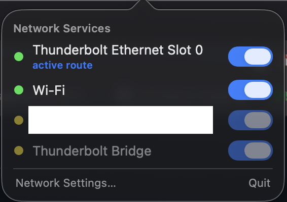
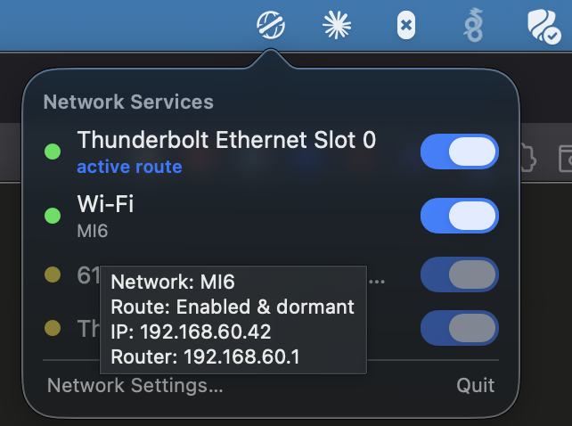

# crossbar

**Enable or disable macOS network services right from the menu bar — without digging through System Settings.**


<p align="center">
  
</p>

## Why crossbar?

Turning a network interface on or off on macOS is buried. To make Wi-Fi or an
Ethernet adapter inactive you have to open **System Settings → Network**, find
the service, open its **⋯** menu, and choose **Make Service Inactive** — several
clicks deep, every time. And once you're juggling more than one connection,
System Settings won't tell you at a glance *which* service is actually carrying
your traffic.

crossbar collapses that into a menu bar dropdown: every network service, its
current state, and a switch. One click to flip it. That's the whole app.

## What it does

- **Lists your network services** (Wi-Fi, Ethernet, Thunderbolt, VPN, …) — the
  same set System Settings shows — sorted sensibly: wired first, then Wi-Fi,
  then VPNs and bridges.
- **One-click enable/disable** per service, straight from the menu bar.
- **Shows what's actually routing.** A green/yellow/gray dot tells you each
  service's state, and an **"active route"** marker calls out the one service
  currently carrying traffic — so disabling a *dormant* connection doesn't look
  like the app did nothing. Dormant services are dimmed so the live ones stand out.
- **Shows your Wi-Fi network** (SSID) right under the Wi-Fi row.
- **Hover for detail** — IP address, route state, and router, without cluttering
  the resting view.
- **Menu bar icon reflects overall state** — it gains a small badge when a
  service is disabled, so "I left something off" is visible at a glance.

<p align="center">
  
</p>

## Requirements

- **macOS 14 (Sonoma) or later** to run.
- **Xcode 26+** only if you build from source.

## Install

### Option 1 — Download the prebuilt app

1. Download the latest `crossbar-vX.Y.Z-universal.zip` from the
   [**Releases**](https://github.com/breed007/crossbar-macos/releases/latest) page.
2. Unzip it and move **Crossbar.app** to `/Applications`.
3. crossbar is **not notarized** (no paid Apple Developer ID), so macOS
   quarantines downloaded copies. Clear the quarantine flag once:
   ```sh
   xattr -dr com.apple.quarantine /Applications/Crossbar.app
   ```
   (Or: try to open it, then click **Open Anyway** under System Settings →
   Privacy & Security.)
4. Launch it. The binary is **universal** — runs natively on Apple Silicon and
   Intel.

### Option 2 — Build from source

```sh
git clone https://github.com/breed007/crossbar-macos.git
cd crossbar-macos
open Crossbar.xcodeproj      # press ▶ Run, or:
xcodebuild -project Crossbar.xcodeproj -scheme Crossbar -configuration Release build
```

Then copy the built `Crossbar.app` to `/Applications`.

---

crossbar runs as a menu bar **agent** — no Dock icon, no app-switcher entry.
Look for the globe-with-crossbar glyph in your menu bar; click it to open the
list. Quit from the popover's footer.

## One-time setup

### 1. Enable toggling (required) — a scoped passwordless `sudo` rule

Reading network state needs no privileges, but *changing* it requires root.
crossbar's v1 backend runs Apple's `networksetup` tool via `sudo`. To avoid a
password prompt on every toggle, add a narrowly-scoped sudoers rule:

```sh
sudo visudo -f /etc/sudoers.d/crossbar
```

Add this single line (replace `breed` with your macOS username):

```
breed ALL=(root) NOPASSWD: /usr/sbin/networksetup -setnetworkserviceenabled *
```

This grants passwordless `sudo` for **only** that one `networksetup`
subcommand — nothing else — which is a reasonable tradeoff on a personal Mac.
Deleting `/etc/sudoers.d/crossbar` fully reverts it. Until the rule is in place,
crossbar still runs and shows everything; it just explains how to install the
rule the first time you try to toggle.

### 2. Wi-Fi network name (optional) — Location Services

To display the connected Wi-Fi SSID, crossbar needs **Location Services**
permission. This isn't a crossbar quirk: since macOS 14 the system withholds the
SSID from any app that lacks location authorization (CoreWLAN, `networksetup`,
and `system_profiler` all redact it). crossbar requests it with a one-time
prompt on first launch and **never starts location updates** — simply holding
the authorization is what unlocks the network name.

- **Allow** → the Wi-Fi row shows its SSID.
- **Deny** → everything else works; the SSID is just omitted.
- Change it any time in **System Settings → Privacy & Security → Location Services**.

## How it works

crossbar is built around one fact: **reading network state is unprivileged;
changing it requires root.** Those two halves are cleanly separated by a
privilege boundary.

- **Read layer** — a `StatusMonitor` backed by `SCDynamicStore` from the
  SystemConfiguration framework. It's fully **event-driven** (no polling): it
  subscribes to network-change notifications and refreshes the model when state
  actually changes. It enumerates services, their enabled state, live IP/link
  info, and the service order (to compute which service owns the default route).
- **Write layer** — a `PrivilegedToggle` protocol (the seam). The v1 backend
  shells out to `networksetup` via the passwordless `sudo` rule, passing
  arguments safely as an array (no shell), validating service names against the
  live set, and serializing toggles. Because the UI only knows the protocol, a
  future backend (e.g. an `SMAppService` daemon over XPC, no sudoers rule) could
  drop in without touching the interface.

Built natively in Swift + AppKit. No third-party dependencies.

## Privacy

- **No network calls, no telemetry, no analytics.** crossbar only reads local
  system configuration and toggles local services.
- **Location** permission, if granted, is used *solely* to read your Wi-Fi
  SSID locally — it never leaves your Mac, and crossbar requests no location
  updates.
- The passwordless `sudo` rule is scoped to exactly one `networksetup`
  subcommand.

## Scope (and non-goals)

crossbar deliberately does one thing well. It intentionally **does not** do
network service priority reordering, location switching, proxy or VPN
configuration, Bluetooth toggling, or bandwidth/speed/public-IP tooling. If you
need those, the per-service **Network Settings…** link opens Apple's native pane.

See [DESIGN.md](DESIGN.md) for the scope philosophy and the reasoning behind each
non-goal (including why Bluetooth is deliberately left out).

## Contributing

Issues and PRs are welcome. crossbar is intentionally small — please keep
changes focused on its one job: seeing and toggling network services from the
menu bar.

## Changelog

See [CHANGELOG.md](CHANGELOG.md) for release history.

## License

[MIT](LICENSE) © 2026 breed007
