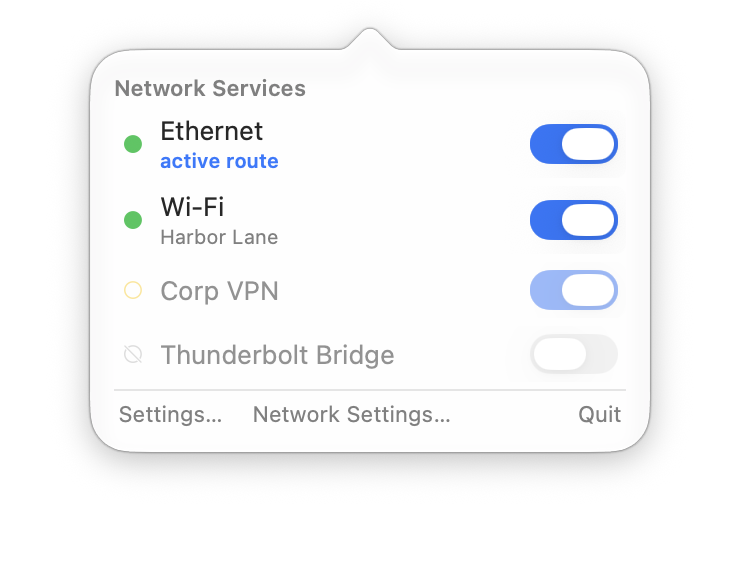
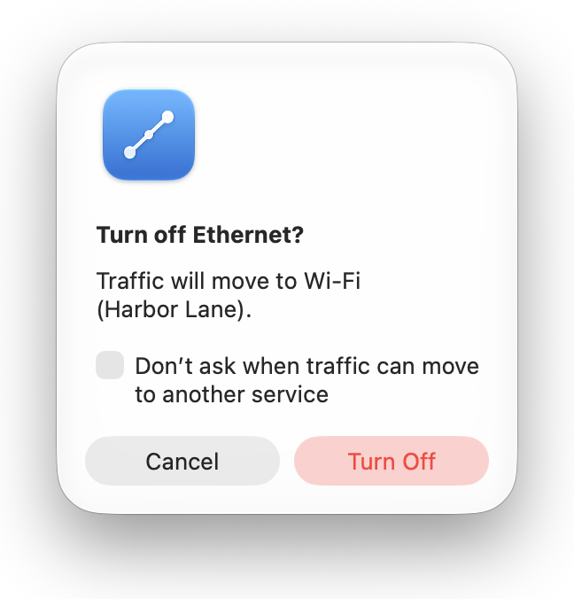
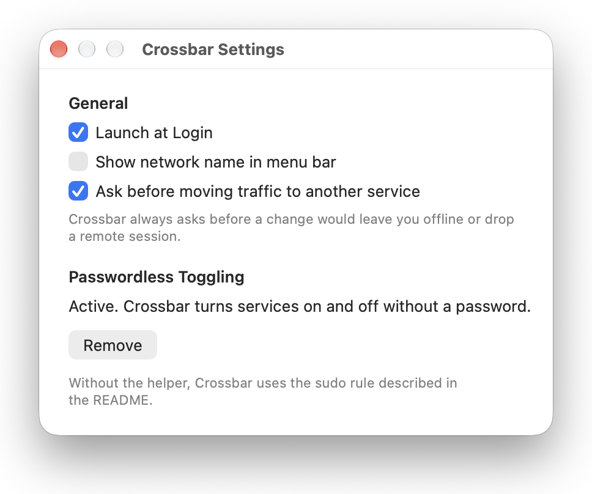

# crossbar

**Turn macOS network services on and off from the menu bar, without digging through System Settings.**


<p align="center">
  <picture>
    <source media="(prefers-color-scheme: dark)" srcset="docs/screenshots/popover-dark.png">
    
  </picture>
</p>
<p align="center"><sub>Screenshots use sample data. <code>scripts/screenshots.sh</code> regenerates them.</sub></p>

## Why crossbar?

Turning a network interface on or off on macOS is buried. To make Wi-Fi or an
Ethernet adapter inactive you open **System Settings → Network**, find the service,
open its **⋯** menu, and choose **Make Service Inactive**, every time. And once
you're juggling more than one connection, System Settings won't tell you at a
glance *which* service is actually carrying your traffic.

crossbar puts that in a menu bar dropdown: every network service, its current
state, and a switch.

## What it does

- Lists your network services (Wi-Fi, Ethernet, Thunderbolt, VPN, …), the same
  set System Settings shows, with wired first, then Wi-Fi, then VPNs and bridges.
- Turns a service on or off with one click, or from the keyboard: Up and Down
  to choose a row, Space to flip it, Escape to close.
- Shows what's routing. Each row's dot says connected (filled), on but not
  connected (hollow), or off (slashed), and an "active route" label marks the
  service carrying your traffic. Dormant services are dimmed. When traffic moves to
  another service, its label fades in there.
- Warns before it surprises you. Turning off the service carrying your traffic
  first says what happens: "Traffic will move to Wi-Fi (Harbor Lane)", or "you'll go
  offline". It always asks when you'd go offline or when an SSH or Screen Sharing
  session could drop. Dormant services never ask.
- Shows a service coming up. Right after you turn one on, its row says
  "Connecting…" until it gets an address.
- Says what changed in the menu bar. After a toggle, "Wi-Fi off" shows next to
  the icon for a few seconds. You can also keep the active network's name there.
  The icon gets a badge when nothing is carrying traffic.
- Works with Shortcuts and Focus. Shortcuts actions turn a service on or off
  and read its state, Siri and Spotlight phrases come built in, and a Focus filter
  can change services when a Focus starts.
- Hover over a row for its full name, route state, IP address, router, and Wi-Fi
  network.

<p align="center">
  <picture>
    <source media="(prefers-color-scheme: dark)" srcset="docs/screenshots/warning-dark.png">
    
  </picture>
</p>

## Requirements

- macOS 14 (Sonoma) or later to run.
- Xcode 26+ and [XcodeGen](https://github.com/yonaskolb/XcodeGen) only if you
  build from source.

## Install

### Option 1: Homebrew (recommended)

```sh
brew tap breed007/tap
brew trust breed007/tap          # one-time — Homebrew requires trusting third-party taps
brew install --cask crossbar
```

### Option 2: Download the prebuilt app

1. Download the latest `crossbar-vX.Y.Z.dmg` (or `-universal.zip`) from the
   [**Releases**](https://github.com/breed007/crossbar-macos/releases/latest) page.
2. Drag **Crossbar.app** to `/Applications` from the disk image (or unzip it there).
3. Launch it. crossbar is signed and notarized with a Developer ID, so it opens
   without any Gatekeeper workaround. It's universal, native on Apple silicon
   and Intel.

### Option 3: Build from source

```sh
git clone https://github.com/breed007/crossbar-macos.git
cd crossbar-macos
xcodegen generate            # creates Crossbar.xcodeproj from project.yml
scripts/test.sh              # runs the unit tests
open Crossbar.xcodeproj      # press ▶ Run
```

To use the passwordless helper, the app must be signed by the same team as its
helper, so a build signed with another team will fall back to the sudo rule below.

---

crossbar runs as a menu bar agent: no Dock icon, no app-switcher entry. Look
for the crossbar glyph (three nodes on a diagonal) in your menu bar and click it to
open the list.

## One-time setup

### 1. Passwordless toggling (recommended)

Reading network state needs no privileges, but *changing* it requires root.
crossbar includes a small signed helper that makes the change for it:

1. Open crossbar and choose **Set Up Passwordless Toggling…**.
2. Turn on **Crossbar** under **System Settings → General → Login Items &
   Extensions**. macOS asks for an administrator password once.

The helper does one thing: turn an existing network service on or off. It only
accepts requests from crossbar signed by its own developer team, checks every
request against your current network configuration, and logs each change (service
ID and result, never names) to the unified log. To remove it, use **Settings… →
Remove**.

### 1b. Or: a scoped `sudo` rule

If you'd rather not install the helper (or your Mac is managed and can't approve
it), crossbar falls back to Apple's `networksetup` through `sudo`. Add this rule
once:

```sh
sudo visudo -f /etc/sudoers.d/crossbar
```

Add this single line (replace `breed` with your macOS username):

```
breed ALL=(root) NOPASSWD: /usr/sbin/networksetup -setnetworkserviceenabled *
```

This grants passwordless `sudo` for only that one `networksetup` subcommand.
Deleting `/etc/sudoers.d/crossbar` reverts it. If neither the helper nor the rule
is set up, crossbar still shows everything and explains both options the first time
you try to toggle.

### 2. Wi-Fi network name (optional): Location Services

To show the connected Wi-Fi network's name, crossbar needs Location Services
permission. Since macOS 14 the system withholds the SSID from any app without it
(CoreWLAN, `networksetup`, and `system_profiler` all redact it). crossbar asks the
first time you open it and never starts location updates; holding the permission
is enough to read the network name.

- If you allow it, the Wi-Fi row shows its network name.
- If you don't, everything else works, without the name.
- Change it any time in **System Settings → Privacy & Security → Location Services**.

## Settings

**Settings…** in the popover covers:

- Launch at Login
- Show network name in menu bar
- Ask before moving traffic to another service. Going offline or dropping a
  remote session always asks, whatever this is set to.
- Passwordless toggling: its status, and Set Up, Open Login Items, and Remove
  buttons.

<p align="center">
  <picture>
    <source media="(prefers-color-scheme: dark)" srcset="docs/screenshots/settings-dark.png">
    
  </picture>
</p>

## Shortcuts and Focus

- Set Network Service turns a service on or off. Get Network Service returns
  a service with whether it's on, connected, and carrying traffic, for conditions.
- Say or search "Turn off Wi-Fi with Crossbar" (or "Turn on…") in Spotlight or Siri.
- For a keyboard shortcut, assign a key combination to a shortcut that uses Set
  Network Service in the Shortcuts app.
- For a Focus filter, open **System Settings → Focus**, choose a Focus, then **Add
  Filter → Crossbar**, and pick services to turn on and off when that Focus starts.
  Turning the Focus off doesn't change them back.

Automations never show crossbar's confirmation (you set up the rule), but each one
posts a notification saying what changed, including where your traffic went. When
a Focus swaps one service for another, crossbar turns the new one on first, so you
aren't briefly offline.

## How it works

crossbar is built around one fact: reading network state is unprivileged, and
changing it requires root. The two halves are separated by a privilege boundary.

- The read layer is a `StatusMonitor` backed by `SCDynamicStore` from the
  SystemConfiguration framework. It's event-driven: it subscribes to
  network-change notifications and re-reads when state changes, with no polling and
  no subprocesses. It reads each service's enabled state, address, and link, and
  the service order, to work out which service owns the default route. It hides the
  same internal interfaces System Settings hides, using their `HiddenConfiguration`
  flag in the I/O Registry.
- The write layer is a `PrivilegedToggle` protocol. `ToggleRouter` sends each change to
  the helper (an `SMAppService` launch daemon reached over XPC, which writes through
  `SCPreferences` by service ID) when it's approved, and to `sudo networksetup`
  otherwise. Neither path ever prompts, which is what lets Shortcuts and Focus use
  them.

See [docs/backend-b-design.md](docs/backend-b-design.md) for the helper's design
and security model. Built in Swift and AppKit, with no third-party dependencies.

## Privacy

- crossbar makes no network calls and has no telemetry or analytics. It only
  reads local
  system configuration and toggles local services.
- Location permission, if granted, is used only to read your Wi-Fi network
  name locally. It never leaves your Mac, and crossbar requests no location updates.
- Notifications are posted only for changes made by Shortcuts or a Focus.
- The helper's log lines stay in your Mac's unified log and record service IDs and
  your local user ID, never service names.
- The `sudo` rule, if you use it, is scoped to exactly one `networksetup`
  subcommand.

## Scope (and non-goals)

crossbar does one thing. It intentionally doesn't do network service priority
reordering, location switching, proxy or VPN configuration, Bluetooth toggling, or
bandwidth, speed, or public-IP tooling. If you need those, **Network Settings…**
opens Apple's native pane.

See [DESIGN.md](DESIGN.md) for the scope rules and the reasoning behind each
non-goal.

## Contributing

Issues and PRs are welcome. crossbar is intentionally small, so please keep changes
focused on its one job: seeing and toggling network services from the menu bar.
See [CLAUDE.md](CLAUDE.md) for build notes and gotchas.

## Changelog

See [CHANGELOG.md](CHANGELOG.md) for release history.

## License

[MIT](LICENSE) © 2026 breed007
